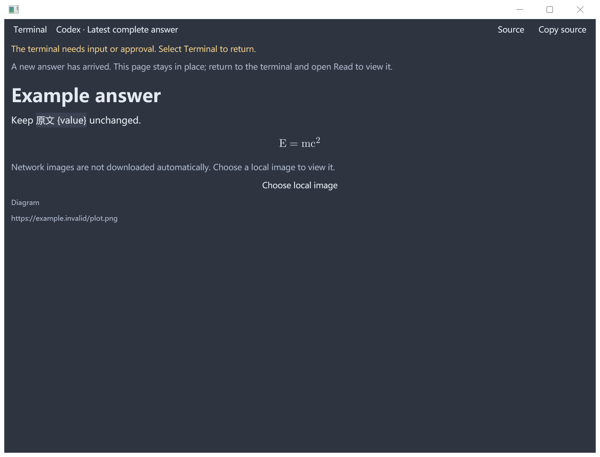
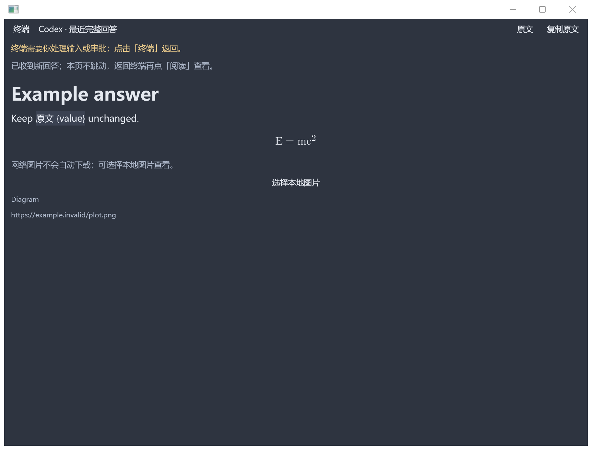

# Answer reader language / 回答阅读器语言

The captured-answer reader uses the selected application language for its controls,
loading and attention notices, image chooser, and image failures. English and
Simplified Chinese messages are supplied; other languages use the existing English
fallback described in [internationalization](internationalization.md).

Changing the language keeps the captured answer and its source-provided image
captions intact. Copy source returns the complete captured text in both reading and
source modes, including Markdown, formulas, braces and non-English content. New
answers leave the open page in place and display a notice directing the user back to
the terminal.

回答阅读器的控件、加载和待处理提示、图片选择及错误信息随应用语言显示。当前提供英文
与简体中文文案，其他语言按现有规则回退英文。切换语言保留回答内容与原有图片说明；
阅读模式和原文模式的“复制原文”均返回完整的捕获文本。新回答到达时，当前页面保持
原位，并显示返回终端查看的提示。

The reader retains its existing limits: a complete answer must fit within 128 KiB;
up to eight images may load, each local file is limited to 12 MiB, and decoded images
share a 64 MiB budget. Additional images display a translated omission notice.
Network images are not downloaded automatically. Local image paths are checked
against the captured working directory; choosing a local file explicitly remains
available when automatic loading is rejected. PNG and JPEG support is unchanged.
The [document model](../nebula_app/src/assistant_answer/document.rs) and
[reader](../nebula_app/src/gpui_shell/terminal/answer_reader.rs) own these limits.

阅读器保留已有的回答和图片上限；超限图片显示对应语言的提示。网络图片不会自动下载，
自动加载本地图片时仍检查工作目录边界。加载被拒绝后，可以主动选择本地 PNG 或 JPEG。

## Native acceptance / 原生验收

These Windows captures use the production reader at 192 DPI (200% scaling), with the
same synthetic answer in both languages. UI Automation verified Terminal, Source,
Copy source and Choose local image labels. Visual inspection covered the title,
attention/new-answer notices, network-image failure, unchanged answer text and math.
Other desktop environments require their own visual acceptance.

The opt-in `native_reader_localization` test opens this fixture. Build the `pebrel`
test binary with `gpui-test-support`, then run the test with `--ignored`, its full name
and `--test-threads=1`. Set `PEBREL_READER_QA_DIR` to a fresh QA directory and
`PEBREL_CONFIG_DIR` to its `config` subdirectory. In that subdirectory,
`pebrel_settings.txt` selects `language=en-US` or `language=zh-CN`.
After the fixture writes its process id to `ready`, verify the controls and inspect
the rendered window. Write `verified` and then `capture-complete` in the QA directory
within 60 seconds to finish; missing verification fails the test. Normal automated
runs leave this desktop fixture ignored.

The automated reader test also clicks Copy source and switches modes in a 420-pixel
logical viewport across English → Chinese → English. It resets the clipboard before
each copy and checks exact source equality, so a stale clipboard cannot pass the test.
Generated/forged image markers, omitted-image bounds and sanitized localized failures
have separate regression coverage. The ownership rationale is recorded in the
[reader presentation decision](../architecture/notes/nebula_app/assistant_answer/2026-09-27-reader-presentation-language.md).
